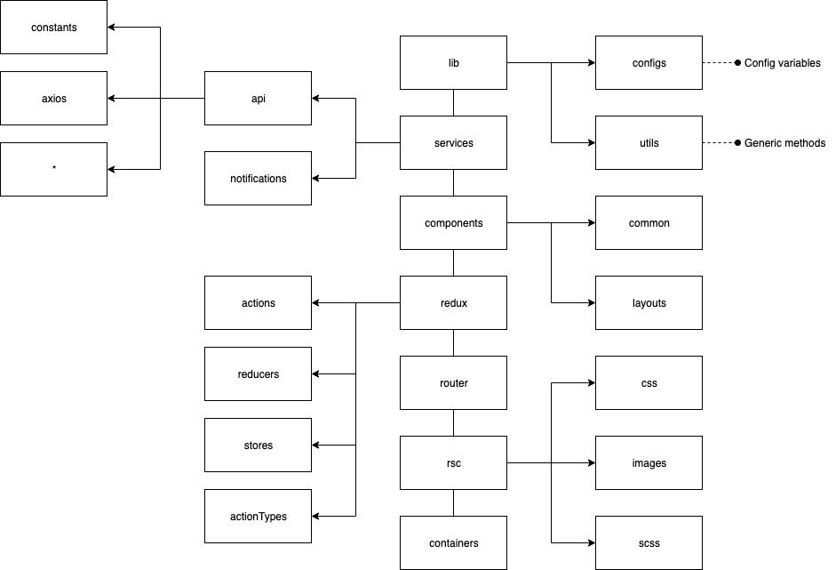

# Overview
This is a React Web Boillerplate with custom components and login function with redux.

# Dependencies
* [axios](https://github.com/axios/axios)

## Services
API calls, push notifications and everything that comes from outside.

# Installation & Usage
* Create `.env` file on the root following the `.env.example` file
* Run project
  * `npm start`

ACCEDER A https://adivinalafuncion.strangled.net/

https://qr.io/dashboard/
# mega-nati-pro-music
